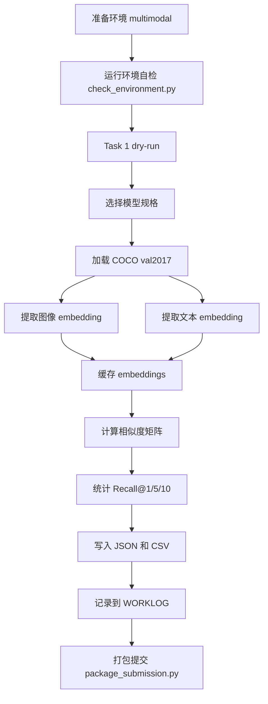

# 项目说明

## 1. 项目目标

这个项目围绕课程 PJ1，比较三类图文对齐模型在统一 COCO `val2017`
协议下的能力差异，并逐步完成三个任务：

- Task 1：图文检索
- Task 2：图像描述生成
- Task 3：表征分析

当前已经先把 Task 1 的主干代码搭起来，并把环境安装、运行时缓存、提交打包、
工作日志和执行流程文档接好。

## 2. 目录结构与组件职责

- `code/`
  - 核心代码
- `code/pj1/runtime.py`
  - 运行时环境配置
  - 管理 Hugging Face / Torch 缓存目录
  - 处理 macOS MPS fallback
- `code/pj1/task1/coco.py`
  - COCO 数据读取与组织
- `code/pj1/task1/models.py`
  - 各模型后端适配层
- `code/pj1/task1/metrics.py`
  - Recall@K 评测
- `code/pj1/task1/run_retrieval.py`
  - Task 1 主入口
- `tasks/task1_retrieval/`
  - Task 1 工作目录
- `tasks/task2_captioning/`
  - Task 2 工作目录
- `tasks/task3_representation/`
  - Task 3 工作目录
- `docs/`
  - 运行说明、项目说明、工作流、计划、日志、改进记录
- `scripts/`
  - 环境安装、自检、打包提交
- `outputs/`
  - 运行产物、缓存、结果

## 3. 当前已实现能力

### Task 1

- 读取 COCO `captions_val2017.json`
- 为每张图片保留全部 captions
- 为图片和文本分别提取 embedding
- 计算相似度矩阵
- 评测：
  - `Text-to-Image Recall@1/5/10`
  - `Image-to-Text Recall@1/5/10`
- 缓存 embedding，避免重复推理
- 汇总成 JSON 和 CSV

### 工程支持

- 统一 conda 环境名：`multimodal`
- 支持 Linux CUDA 12.4、CPU、macOS MPS 三种安装路径
- 统一运行前环境自检
- 提交打包时自动忽略数据、缓存、权重

## 4. 项目流程图

## 5. 各文档的用途

- [运行说明](运行说明.md)
  - 告诉你怎么装环境、怎么跑、会产生什么结果
- [执行工作流](执行工作流.md)
  - 每次开始运行前都先看这个，按它的顺序做
- [WORKLOG](WORKLOG.md)
  - 记录实际做了什么、出了什么问题、怎么修的
- [PLAN](PLAN.md)
  - 记录各任务目标和当前阶段
- [IMPROVEMENTS](IMPROVEMENTS.md)
  - 记录下一轮想补的点

## 6. 迁移到 GitHub / 服务器后的工作方式

1. 在 GitHub 仓库中同步当前代码。
2. 在服务器上按 [运行说明](运行说明.md) 建环境。
3. 先跑环境自检和 dry-run。
4. 再逐个做 smoke test。
5. 最后跑全量 Task 1。
6. 如果失败，把报错和环境检查结果回传，我再继续改。
